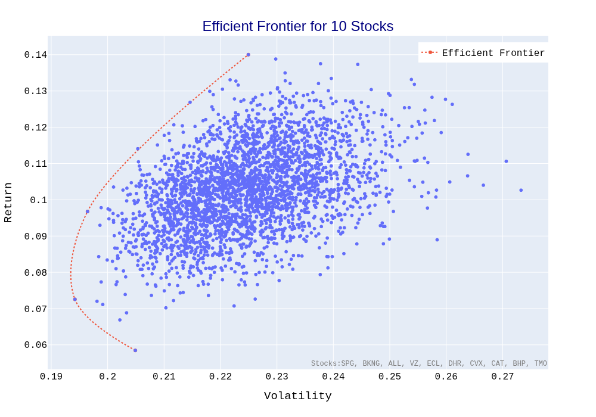

# 📈 Building a Portfolio Using the Efficient Frontier (Python & Jupyter)

This project demonstrates how to construct an optimized investment portfolio using **Modern Portfolio Theory (MPT)** and the **Efficient Frontier** — implemented entirely in a Jupyter Notebook.  

It walks through the complete workflow of portfolio analysis: **data collection**, **data processing**, **Monte Carlo simulation**, and **data visualization**, all in Python.

---

## 🧩 Project Overview

The Efficient Frontier is a cornerstone concept in modern portfolio theory.  
It represents the set of optimal portfolios that offer the **highest expected return for a defined level of risk** (or the lowest risk for a given level of return).

This notebook illustrates the step-by-step process of building such a portfolio using historical stock data.

---

## 📊 Example Visualization

*Efficient Frontier*  
The efficient frontier is a graph showing the set of optimal portfolios that offers the highest expected return for a given level of risk or, conversely, the lowest possible risk for a given expected return. Portfolios below this curve are considered suboptimal because they either deliver too little return for the risk taken or take on too much risk for a given level of expected return


*My Simulation*
The portfolios on the frontier are considered optimal, and we can choose the portfolios based on the risk appetite and other preferences.



---
## 🗂️ Contents

### 1. Data Gathering
- Fetch historical stock price data using `yfinance` or similar APIs.
- Select a group of assets (e.g., AAPL, MSFT, GOOG, AMZN, etc.).
- Clean and align the data for analysis.

### 2. Data Processing
- Calculate **daily returns** and **covariance matrix** of selected assets.
- Compute pairwise **correlation coefficients**.
- Summarize risk and return characteristics for each stock.

### 3. Monte Carlo Simulation
- Generate thousands of random portfolios by varying asset weights.
- Calculate **expected returns**, **volatility**, and **Sharpe ratios** for each portfolio.
- Identify the **optimal portfolio** based on the highest Sharpe ratio.

### 4. Data Visualization
- Plot all simulated portfolios on the risk-return plane.
- Highlight the **Efficient Frontier** curve.
- Mark the **maximum Sharpe ratio portfolio** and **minimum volatility portfolio**.
- Visualize weight allocations for optimal portfolios.

---

## 🧠 Key Concepts Covered
- Efficient Frontier Theory  
- Portfolio Optimization  
- Monte Carlo Simulation  
- Covariance & Correlation Analysis  
- Sharpe Ratio Calculation  
- Financial Data Visualization  

---

## 💻 Technologies Used
- **Python 3**
- **Jupyter Lab**
- **Pandas**
- **NumPy**
- **Plotly**
- **yfinance**
- **tqdm**
- **rich**

---


## 🚀 How to Run

1. Clone the repository:

   ```bash
   git clone https://github.com/KuoLiang-hub/building_portfolio_with_efficient_frontier
   cd building_portfolio_with_efficient_frontier
   ```

2. Install dependencies:

   ```bash
   pip install -r requirements.txt
   ```

3. Launch Jupyter Notebook:

   ```bash
   jupyter lab
   ```

4. Open the notebook and run all cells sequentially.

---

## 🧾 Output Highlights

* Summary of portfolio performance metrics.
* Visualized Efficient Frontier.
* Optimal portfolio composition (weight distribution).
* Interactive insights on risk and return trade-offs.

---

## 📚 References

* Markowitz, H. (1952). *Portfolio Selection*. Journal of Finance.
* Investopedia: [Efficient Frontier Explained](https://www.investopedia.com/terms/e/efficientfrontier.asp)

---

## 🧑‍💻 Author

**Kuo Liang**
📅 Created: October 2025
🔗 [LinkedIn](https://www.linkedin.com/in/kuo-l-32968a211/) | [GitHub](https://github.com/KuoLiang-hub)

---

## 🪙 License

This project is licensed under the [MIT License](LICENSE).

